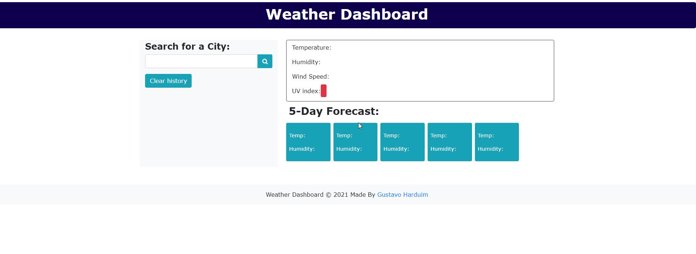
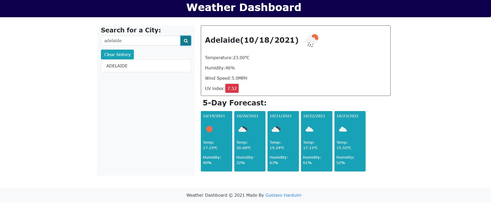

# Weather Dashboard

## Short description

A weather dashboard with form inputs with current and future conditions for that city and that city is added to the search history.

```
GIVEN a weather dashboard with form inputs
WHEN I search for a city
THEN I am presented with current and future conditions for that city and that city is added to the search history
WHEN I view current weather conditions for that city
THEN I am presented with the city name, the date, an icon representation of weather conditions, the temperature, the humidity, the wind speed, and the UV index
WHEN I view the UV index
THEN I am presented with a color that indicates whether the conditions are favorable, moderate, or severe
WHEN I view future weather conditions for that city
THEN I am presented with a 5-day forecast that displays the date, an icon representation of weather conditions, the temperature, the wind speed, and the humidity
WHEN I click on a city in the search history
THEN I am again presented with current and future conditions for that city
```

## Table of Contents

- [Screenshots](#screenshots)
- [Github](#github)

## Screenshots






## Github

1. I have created a new repository on your GitHub account and clone it to my computer.

2. I used the `git add`, `git commit`, and `git push` commands to save and push my code to my GitHub repository.

3. My repository is https://github.com/gharduim/weather-dashboard/

4. My live webpage is  https://gharduim.github.io/weather-dashboard/
